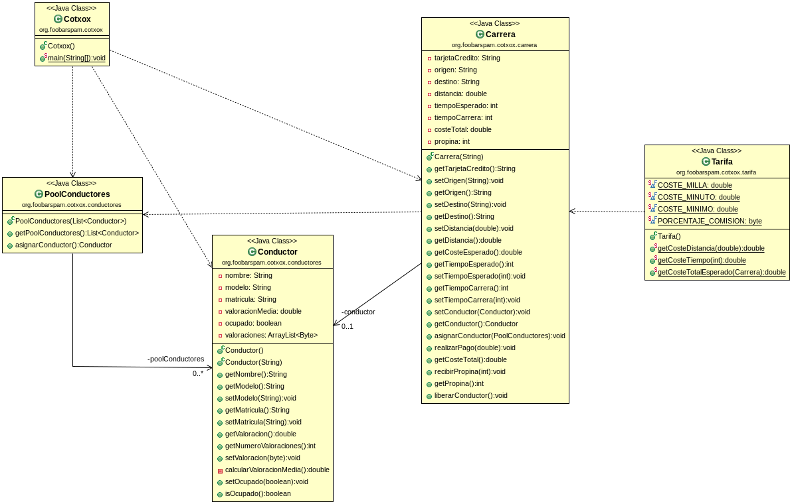

# Cotxox

La función de este proyecto es buscar un conductor en la lista de conductores cuando un cliente contrate un taxi.
Calcularemos el coste de la carrera mediante las tarifas y tendremos en cuenta el tiempo que se tarde y la distancia recorrida.

